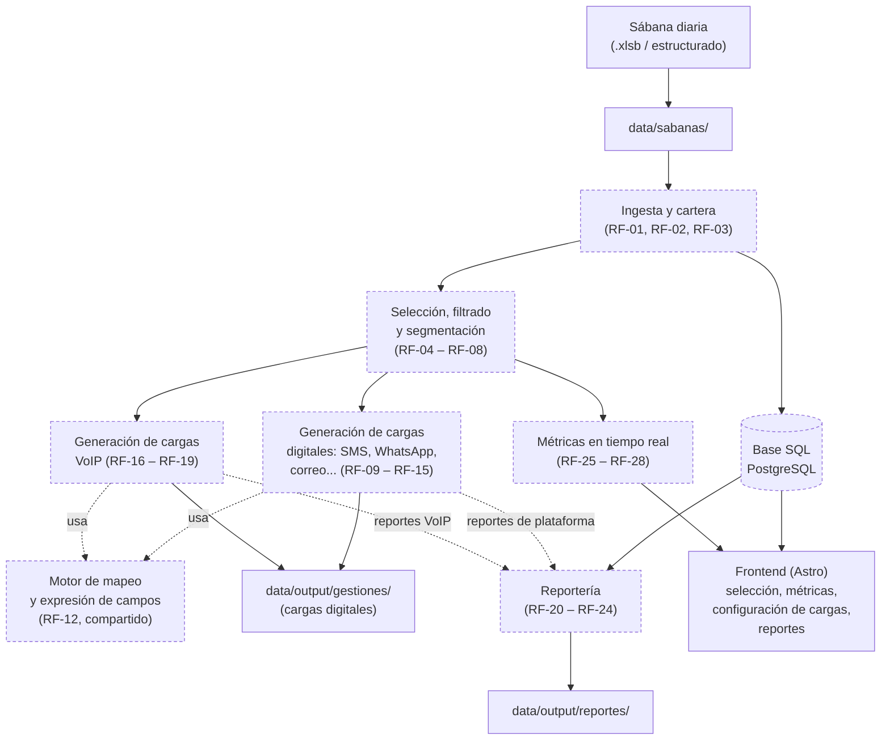

# Arquitectura

## Mapa conceptual

*Los bloques con borde punteado representan piezas de backend aún no implementadas. El detalle funcional completo de cada bloque está en `docs/atomics-requirements.md` (RF-01 a RF-36); el desglose de módulos y sus dependencias en `docs/modules.md`.*

## Flujo de datos

1. **Ingesta y cartera**: se cargan sábanas diarias (formato estructurado, p. ej. `.xlsb`) en `data/sabanas/`; el sistema valida/normaliza documentos de identidad y teléfonos, detecta inconsistencias, y actualiza la cartera de productos (RF-01 – RF-03).
2. **Selección, filtrado y segmentación**: sobre la cartera vigente se seleccionan los productos de la asignación del día, se aplican filtros simples/complejos, se segmenta por atributos, se consulta el historial consolidado de gestiones multicanal, y se puede acotar la lista final a los primeros "n" registros (RF-04 – RF-08).
3. **Métricas en tiempo real**: en paralelo a la selección, se recalculan automáticamente los indicadores (capital, cuentas, segmentos, cuotas) y cualquier indicador adicional configurado por el usuario (RF-25 – RF-28).
4. **Generación de cargas**: a partir de la selección final, se generan en paralelo (a) cargas para plataformas digitales (SMS, WhatsApp, correo, etc.) y (b) cargas para plataformas VoIP. Ambas rutas comparten el mismo motor de reglas de mapeo/expresión de campos (RF-12) pero mantienen reglas de transformación y estructura independientes por plataforma (RF-09 – RF-19). Las salidas se vuelcan en `data/output/gestiones/`.
5. **Reportería**: se generan reportes a partir de múltiples fuentes — la base de datos con el histórico completo de sábanas, los reportes descargados de las plataformas digitales tras el envío de cargas, y los reportes de gestiones VoIP — hacia `data/output/reportes/` (RF-20 – RF-24).
6. **Visualización**: el frontend Astro consulta el backend (vía una API por definir) para exponer selección/filtrado, métricas, configuración de cargas y reportes.

## Principio arquitectónico: puertos/adaptadores con vertical slicing (RF-30)

Todos los módulos del sistema (ver `docs/modules.md`) se diseñan bajo dos reglas combinadas:

- **Inputs/outputs y adaptadores**: cada módulo expone entradas y salidas bien definidas (puertos); la integración con sistemas externos (plataformas digitales, VoIP, CRM, bases de datos) se delega a adaptadores independientes y sustituibles. Agregar una plataforma nueva (p. ej. una VoIP adicional) implica añadir un adaptador, no modificar el núcleo del módulo.
- **Vertical slicing interno**: dentro de cada módulo, el código se organiza por caso de uso de extremo a extremo (por ejemplo, "generar carga SMS" o "generar reporte especializado") en lugar de organizarse únicamente por capas técnicas (controladores/servicios/repositorios). Esto mantiene cada módulo autocontenible, fácil de mantener y de extender sin impactar a los demás.

Este principio es la razón por la que el motor de reglas de mapeo y expresión de campos (RF-12) se modela como un módulo núcleo compartido (ver `docs/modules.md`, módulo 4) en vez de reimplementarse dentro de cada adaptador de plataforma: evita duplicación entre cargas digitales y cargas VoIP, que consumen la misma capacidad con reglas propias por plataforma.

**Implementación de referencia (Fase 0):** `backend/app/` ya sigue esta convención — `core/{entities,ports,services}` para el núcleo, `adapters/{input,output,persistence}` para la infraestructura, y `api/` para los routers HTTP. El caso de uso `health` (`core/services/health_service.py` + `core/ports/health_port.py` + `adapters/persistence/postgres_health_adapter.py` + `api/health.py`) es la vertical slice de referencia que deben replicar los casos de uso reales a partir de la Fase 1. Detalle de comandos y convenciones en `backend/AGENTS.md`.

La configuración (reglas de transformación, formatos, criterios de filtrado) se prioriza sobre valores rígidos en código (RF-32), y el sistema debe poder incorporar nuevas plataformas, formatos de archivo y reglas de negocio sin modificaciones significativas en los módulos existentes (RF-31, RF-33).

## Stack tecnológico

| Capa | Tecnología | Estado |
|---|---|---|
| Frontend | Astro + TypeScript | Scaffold mínimo creado (`frontend/`) |
| Backend | Python gestionado con **uv**, API REST con **FastAPI**, `ruff` + `pytest` | Esqueleto implementado en `backend/` (puertos/adaptadores + caso de uso de referencia `health`, end-to-end y en verde) |
| Base de datos | **PostgreSQL** (decidido) | Motor de BD instalado localmente; falta crear el rol/base de datos del proyecto (`backend/scripts/init_db.sql`, paso manual) |
| Comunicación frontend↔backend | **API REST separada** (decidido) — backend Python expone endpoints, Astro los consume | Endpoint `GET /health` implementado y probado; sin endpoints de negocio aún |
| Disparador del procesamiento | **Bajo demanda desde el frontend** (decidido) — sin cron; el usuario sube la sábana y dispara la ingesta desde la UI | No implementado (depende de la Fase 1) |

**Justificación de las decisiones:** PostgreSQL por su soporte de JSON/JSONB, útil para almacenar la información completa de cada sábana (campos variables e invariables, RF-21) y para el historial evolutivo (RF-22). API REST separada para desacoplar frontend y backend, facilitar pruebas, y dejar abierta la integración futura con otros clientes o sistemas (CRM, VoIP, plataformas digitales — alineado con RF-30). FastAPI porque su tipado con Pydantic encaja con el parseo/tipado de campos de RF-12, es async nativo y genera documentación OpenAPI automática. Disparo bajo demanda porque RF-01 pide carga vía interfaz y evita depender de infraestructura de cron desde el inicio.

## Primeras integraciones objetivo (decidido)

- **Plataformas digitales (RF-09 – RF-15):** las primeras a integrar son **SMS** y **WhatsApp**; correo electrónico queda para una iteración posterior. Ver `docs/modules.md`, módulo 5.
- **Plataforma VoIP (RF-16 – RF-19):** **Cisvox**, de la empresa peruana **Kontactus**, es la plataforma objetivo de la primera integración. Ver `docs/modules.md`, módulo 6. Su estructura de cabeceras/campos concreta debe levantarse con el usuario o su documentación antes de implementar el adaptador (RF-18).

## Decisiones pendientes (TBD)

- Estructura exacta de cabeceras/campos que exige Cisvox y las cargas SMS/WhatsApp elegidas — se levanta al implementar cada adaptador (RF-18, RF-10).
- Proveedores concretos de SMS y WhatsApp (pasarela/API específica de cada canal) — aún no se han elegido, solo el canal.

El esquema exacto de la "sábana" (antes `TBD`) ya cuenta con muestras reales en `data/sabanas/` (formato `.xlsb`, entidad IMPULSE) — pendiente formalizarlo como parte de la Fase 0 de `docs/planning.md`.

Las decisiones restantes deben resolverse con el usuario antes de iniciar la implementación del backend (ver [planning.md](planning.md)).
